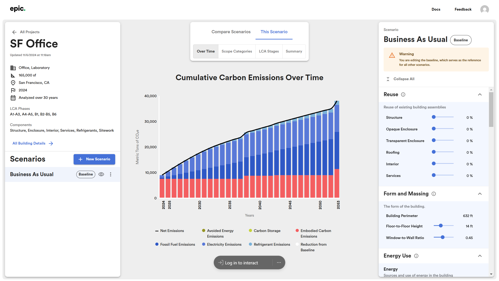

# 4️⃣ Compare Scenarios

After [constructing scenarios](carbon-reduction-measures/), they can be compared in the "Compare" tab. Typically, multiple strategies for reducing carbon emissions are under consideration in the early project phases. In EPIC, these strategies can be compared graphically and numerically.

Use the  toggles in the left-hand panel to add or remove scenarios from the Compare charts. Scenarios will be plotted in the order in which they appear in the left-hand panel list.

### Cumulative Emissions Over Time

This figure compares each scenario to the baseline across the analysis period.

<figure><figcaption>
Time series comparison of baseline and two scenarios for a project. 
</figcaption></figure>

Note that some carbon reduction measures can actually _increase_ emissions, an effect that can lead to confusion in interpreting the Cumulative Emissions Over Time figure. For instance, substituting the structural system can increase or decrease the embodied emissions depending on the nature of the change, or the addition of a PV array incurs embodied emissions even if it lower operational emissions over time. Accordingly, the patterns in this figure require interpretation based on the carbon reduction measures modeled for each scenario.

### Summary Chart

This figure compares the cumulative emissions for each scenario at the end of the analysis period.

<figure><figcaption>
Comparison of embodied, operational, and sequestered and avoided emissions at 30 years.
</figcaption></figure>

In addition to comparing magnitude of emissions at the end of the analysis period, this chart is useful for comparing the proportion of emissions between scenarios. In comparing these proportions, however, please note the selected analysis period. Operational emissions accrue over time, so the proportion of embodied to operational emissions is highly sensitive to the study's time horizon. The time horizon in EPIC is shorter than those most often used in wbLCA in order to support project teams in meeting time-based climate targets.&#x20;

This chart has a number of elements:

* **Reduction from Baseline**. Cumulative reduction in emissions of the current scenario as compared to the baseline.
* **Refrigerant Emissions**. Cumulative emissions associated with the refrigerant use in the building services.&#x20;
* **Electricity Emissions**. Cumulative emissions associated with the energy use from the electrical grid.&#x20;
* **Fossil Fuel Emissions**. Cumulative emissions associated with onsite fossil fuel use.&#x20;
* **Embodied carbon emissions**. Cumulative emissions associated with building materials, their replacements, and with landscape maintenance.
* **Biogenic Carbon**. Sequestered emissions from building structure and landscape planting.
* **Avoided Energy Emissions**. Avoided emissions from onsite energy generation in excess of use.
